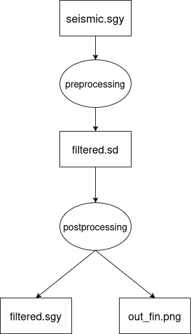

# 📘 Описание
Этот репозиторий содержит скрипты и инструкции для запуска одного и того же тестового workflow (рабочего процесса) с использованием различных систем управления рабочими задачами (Workflow Management Systems, WMS). Цель — провести сравнительный анализ этих систем на практике: насколько просто настроить, какова производительность, удобство использования и совместимость с форматом CWL (Common Workflow Language).

# 🔬 Описание кейса
В качестве тестового кейса используется workflow, который имеет следующую схему:

# 📂 Структура репозитория
Каждая система представлена в отдельной директории со следующими материалами:
* Скрипты для запуска кейса «с нуля»
* Инструкции по установке зависимостей
* Описание особенностей реализации под конкретный WMS

# ✅ Подготовленные WMS
## Cwltool
Используется скрипт на Common Workflow Language (CWL). Успешно выполнен запуск всего кейса.

## Pegasus
Несмотря на заявленную ограниченную поддержку CWL, запустить кейс с использованием Pegasus не удалось. Более того, при попытках выполнить тот же самый workflow средствами Pegasus, время выполнения оказалось примерно в **20 раз больше**, чем при запуске без использования WMS или с другими системами.

## Luigi
Workflow переписан в стиле Luigi. Успешный запуск, производительность приемлемая. Важной особенностью является необходимость ручного управления зависимостями между задачами.

## Nextflow
При помощи библиотеки Janis скрипт, написанный ранее для cwltool, был преобразован в скрипт для Nextflow, который был успешно выполнен. Время выполнения оказалось в 2 раза больше, чем при запуске без использования WMS.

## Dask
Предназначен преимущественно для работы с коллекциями -- `numpy`, `pandas`, -- и `scikit-learn`. Используется Jupyter Notebook. Имеет графический интерфейс. Время выполнения было в 2 раза больше по сравнению с запуском без WMS

## Apache Airflow с CWL-Apache
Имеет удобный интерфейс. При помощи CWL-Apache удалось успешно запустить скрипт, написанный ранее для cwltool. Тем не менее, имеет сложную процедуру установки, в которую входит установка двух разных версий Python.

# 🚀 Как использовать
Для запуска любого кейса перейдите в соответствующую директорию и следуйте инструкциям в README.md внутри неё. Все кейсы запускаются с нуля, однако некоторые требуют загрузки предварительных данных (ссылки и инструкции приведены в каждом разделе).

# 🛠 Зависимости и окружение
Для удобства рекомендуется использовать виртуальное окружение (например, venv или conda). Некоторые фреймворки могут требовать Docker.
