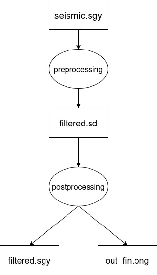

# Benchmark Workflow Source Code

This directory contains the Python source code for the test workflow used in benchmarking. The workflow is composed of two sequential tasks, where the second task depends on the output of the first one.

## Workflow Diagram

## Task Description

The workflow executes the following sequence of operations:

1.  **Task 1 (`task1.py`):** Reads raw seismic data from an input source, applies an initial filtering algorithm, and writes the processed data to an intermediate file.
2.  **Task 2 (`task2.py`):** Reads the data from the intermediate file, performs further transformations, saves the transformed data to a final output file, and generates a plot visualizing the final data.

## Design Rationale

This specific workflow design was chosen for several key reasons, making it well-suited for benchmarking Workflow Management Systems (WMS):

* **File-based Dependency:** The workflow consists of at least two distinct tasks with a file-based dependency. This allows us to verify how effectively a WMS tracks, manages, and transfers intermediate data products between steps.
* **Linear Structure:** The strictly linear design (`task1` must complete before `task2` can start) eliminates parallelism. This is a deliberate choice to ensure that performance measurements accurately reflect the scheduling overhead and execution efficiency of the WMS for sequential tasks, rather than their parallel scheduling capabilities.
* **Substantial Runtime:** The baseline execution time of the workflow without any WMS is approximately 23 seconds. This runtime is long enough to minimize the noise from system startup and accurately measure the overheads imposed by each WMS, yet short enough to allow for repeated executions in a reasonable timeframe.

## Known Limitations

It is also important to acknowledge the limitations of this benchmark workflow:

1.  **No Parallelism Test:** The linear structure, while ideal for measuring sequential overhead, does not test the ability of a WMS to manage parallel tasks or complex, non-linear dependency graphs. Evaluating parallel performance would require a different workflow structure.
2.  **Modest Scale:** While the ~23-second runtime is sufficient for this study, it does not represent the scale of large, real-world scientific workflows that might run for many hours or days. The performance overheads observed here may scale differently on much larger workloads.

## Dependencies

All Python library dependencies required to run `task1.py` and `task2.py` are listed in the `requirements.txt` file in this directory.

